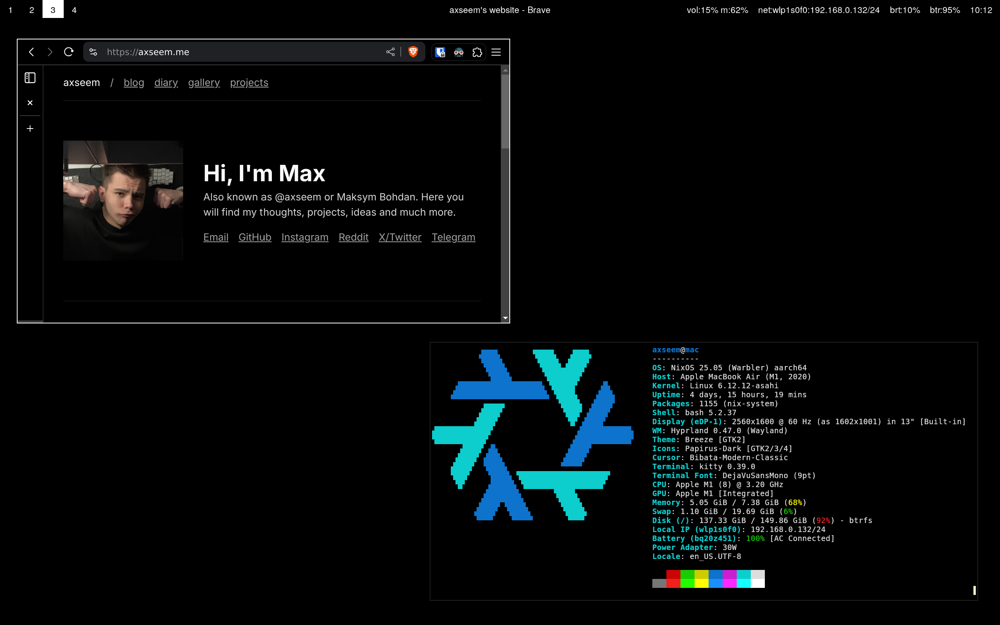

# axseem's Linux Workstation Configuration

NixOS configuration for Apple Silicon laptops (Thanks to [Asahi](https://asahilinux.org) and [nixos-apple-silicon](https://github.com/tpwrules/nixos-apple-silicon)).

I currently use a MacBook Air M1 on a daily basis, but plan to switch to [Framework 13](https://frame.work/laptop13).